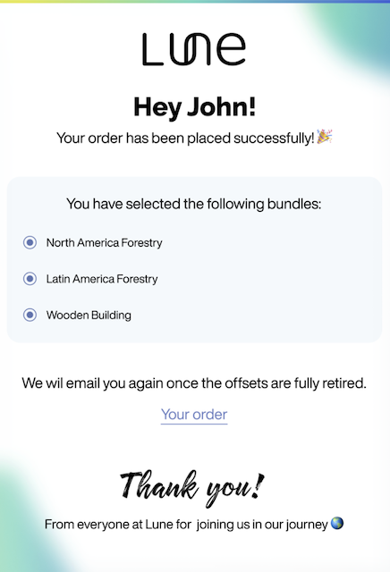
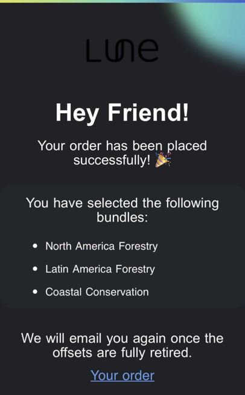

### Foreword 

These days I lead Frontend at [Lune](https://lune.co/) (_we're hiring by the way..._).  
I recently coded an HTML email template. What follows is a fictional convo between my past self from last week and 
the email coding guru I am today.

Obviously I'm ripping off... ahem ...paying homage to my all time-favourite blog post:
[How it feels to learn JavaScript in 2016](https://hackernoon.com/how-it-feels-to-learn-javascript-in-2016-d3a717dd577f)

### Coding an HTML Email in 2021: A conversation

Hey, my boss said you're good with HTML emails. Could you help me out?

**— Sigh... I guess.**

Great, thanks! So I have to code a dynamic HTML template. Here's the design:



Should be easy. It's just a static HTML page, right? I style stuff like this all the time. Let's just start with gradient bar on top 
and the ```"Hi {name}"``` heading...
```html
<div class="gradientBar"/>
<div class="greeting">Hi {name}!</div>
```
Easy does it! Then I do the class definitions in a separate stylesheet file...
```css
.gradientBar {
    height: 4px;
    width: 100%;
    background: linear-gradient(90deg, rgb(229, 232, 77), rgb(108, 215, 194), rgb(60, 93, 215));
}
.greeting {
    font-size: 32px;
    display: flex;
    justify-content: center;
}
```
Great! From here I just...

**— Are you insane!?! That's not how it works! It's not how any of this works!**

Oh...

**— You can't load a separate stylesheet, it will get blocked. It all goes in a single file.**

That's a bit messy. Well... no biggie, I'll put my classes in a `<style/>` tag in `<head>`...

**— You can't use `<style>` in `<head>` - some client will strip out the head content...**

Oh... OK, I'll put `<style>` in `<body>` then...

**— You can't use `<style>`. Some clients strip out `<style>` tags altogether. Styling is done inline.**

Oh... That won't read great... But ok, here we go:
```html
<div style="height: 4px; width: 100%; background: linear-gradient(90deg, rgb(229, 232, 77), rgb(108, 215, 194), rgb(60, 93, 215));"/>
```
Does that work?

**— The background CSS property is not universally supported. Your gradient bar won't render in some clients.** 

How do I fix it?

**— You could use the `bgcolor` attribute:**
```html
<div bgcolor="Value"/>
```

_Bgcolor_? What's that!?!

**— It's how we used to set the background colour of elements back in '89 when the Internet was first being developed
in a bunker in the Cheyenne mountains.**

And email clients still support it?

**— Yep. But only for solid colours.**

So no gradient?

**— No gradient.**

How can I actually implement the gradient?

**— Instead of styling, you can include it as a pre-rendered image. You'll need basic image editing skills...**

Oh... (`fast-forwarding`) Ok, here, I've created the image:


I just host it and include it like so?
```html
 
```

**— Yes.**

And it works for every client?

**— Absolutely! ...if it loads.**

What do you mean "if it loads" !?! Why wouldn't it load?

**— Sometimes images are blocked. Some clients block them by default. It's a security/privacy thing.**

Can I include the image in the email itself? That way it's not loaded from a remote source?

**— Absolutely! You can add a Base64-encoded image like this here:** 
```html

```

**...or you could use `CID Embedded Images`. CID (_Content-ID_) is a way of referencing resources attached to the email.**

Ah! And my image is sure to display with either of those, right?

**— Of course not. It can still get blocked.**

So how does that stuff help!?!

**— It doesn't. But you could use it, if you wanted...**

Seriously: how do I make sure my gradient bar image displays everywhere!?!

**— You can't. Just design your email such that it looks good without images. In case they're blocked...**

I'm supposed to use pre-rendered images because CSS might not be consistently supported. But images might also not load consistently?
How are images better than CSS then? Will nothing work consistently!?!

**— With CSS there's no telling how it will render. But if an image happens to load - it will generally look as intended. Unless of course Dark Mode kicks in...** 

Do images change when viewed in Dark Mode?

**— No, but everything else does. Dark font on a light background inverts to
light font on a dark background etc. Images remain unchanged but might look bad
within the new colour scheme. Look:**



That does look terrible! Can I force my email to always display in Light Mode?

**— No.**

But the Mail app on my Mac is set to Dark Mode and still displays my test emails in the original colour scheme?

**— The Mail client on Apple devices will generally keep the original colour scheme if the email includes images. But other
clients will always force Dark Mode colours.**

Can I detect if the client is set to Dark mode?

**— Yes, you can use _prefers-color-scheme_ CSS media feature**

Let me guess: it's not universally supported?

**— No, it's not**

Is anything supported? Can I use CSS at all?

**— Of course you can use CSS! Just make sure to individually check the support for each CSS property
you'll use.**

OK. Back to the image: how do I make it work for light/dark mode?

**— Just come up with a design where the same images look good in both light and dark mode.**

And this design also has to look good if the images are blocked altogether?

**— Exactly! You're starting to get it! While we're on the subject of design: I can't help noticing your current design includes overlapping elements:**


What's wrong with overlapping elements? Is that also not supported?

**— It's supported. Sort of. Not really. Look, it can work, but it gets complicated. Just stay away from overlapping things.**

Right... back to the drawing board with my design then... (`fast-forwarding`) Here’s the new design:


This is good right? It works in light/dark mode, it works if images are blocked, no overlapping elements?

**— It's OK.**

Great, the rest of the design is just centered text like this here:
```html
<div style="display: flex;justify-content: center;">Hi {name}!</div>
```

**— Flexbox is not...**

...universally supported. I had a feeling you'd say that... How do I center things then?

**— Tables.**

Tables? No Flexbox, no CSS Grid, no Bootstrap, no nothing? Just `<Table/>` like it's 1999?

**— Yes, exactly like that.**

(*sighs audibly*)

OK, I'll use tables... (`fast-forwarding`)

OK, it's done - It's all styled and ready to go. Now I just send the emails right from my server?

**— Yeah, except they're probably going to get marked as spam. You should send them through an email delivery service like Mailchimp or Sendgrid.**

That way they'll definitely get delivered and not get flagged as spam?

**— They'll probably get delivered, yes.**

"Probably"... The same as my images that will "probably" load?

**— The very same!**

(*sighs audibly*) 

Anything else?

**— No... Well maybe check that your email still looks ok after its forwarded?**

Forwarded? Why would that matter?

**— Emails get re-rendered when you use "forward" or "reply" and they'll end up looking a bit different. Tags might have been added.
Tags might have been removed. The whole thing might be wrapped in quotes. That sort of thing.**

This is insane. I'm just coding a simple `Order Confirmed` email. What do I have to do!?!

**— Get a design that works in Light/Dark Mode, works with blocked images, works rendered as plain text and doesn't contain overlapping elements.
Then implement it using inline, supported CSS rules and only use HTML Table for the layout.
Then make sure it's not getting flagged as spam, and renders well in all 32 popular mail clients both when first received and when forwarded.**

**What's the problem?**


