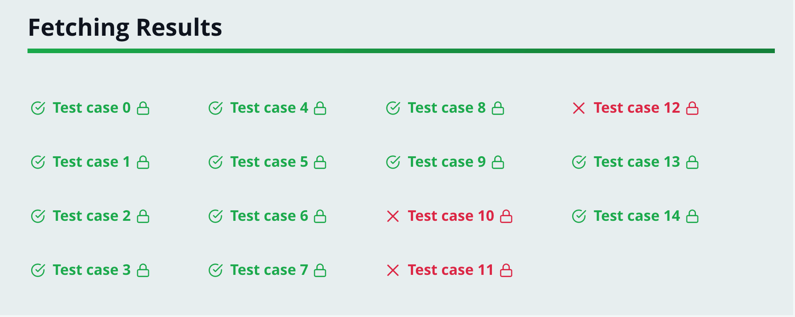
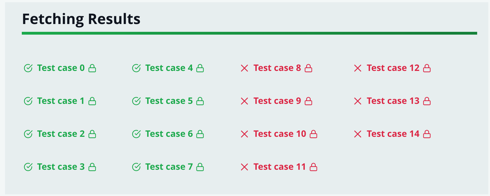
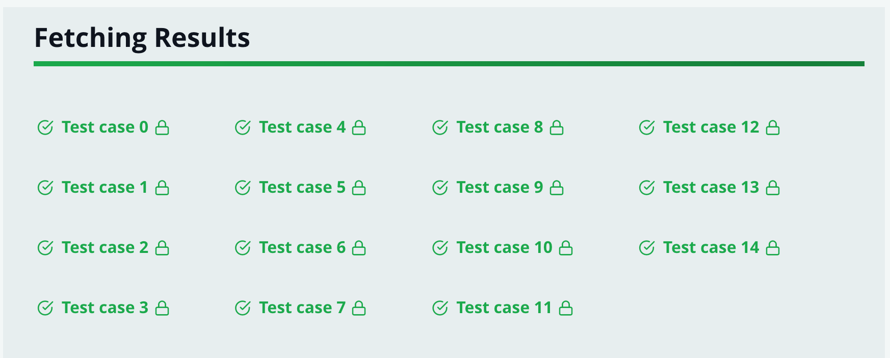

Hackerrank is a collection of encapsualted programming challanges.
You get a task description, an empty function and a comprehensive set of unit tests.
In the empty function, you punch a solution in your coding language of choice (probably JS if you're reading this)
You run the unit test and if they come back green you've suceeded.

As a frontend dev I rarely worry about the performance of array operations.
But recently solving [Minimum Swaps 2](https://www.hackerrank.com/challenges/minimum-swaps-2/problem)
on Hackerrank made me reconsider.

## The "Minimum Swaps 2" task

> You are given an unordered array consisting of consecutive integers [1, 2, 3, ..., n] without any
> duplicates. You are allowed to swap any two elements. You need to find the minimum number of swaps
> required to sort the array in ascending order.

## The perfomance problem

The "Minimum Swaps 2" task is fairly straightfoward but my solution kept failing a few test cases
with "Terminated due to timeout :( Your code did not execute within the time limits" errors.
This is Hackerrank telling you your code is slow.

Before reading on, go play around with the problem on your own. Did you get all test cases to pass?

## The solution

We essentially have to sort the array and keep count of the swaps we performed in doing so.
So something like this:

1. Loop through all array members
2. For each member:
3. Check if value of current member matches its expected position in the numerical sequence
4. If integer NOT matching expected position:
* Find the integer within the array that does match the position
* Swap the matching integer and the current integer
* Increment the swap count

There might be a math-based solution that doesn't require iterating through the entire array but I
couldn't come up with one. OK, Let's lay down some code:
```javascript
// Complete the minimumSwaps function below.
function minimumSwaps(arr) {
    let swapCount = 0;
    arr.forEach((currentInt, index) => {
        const position = index + 1;
        if (currentInt !== position) {
            const indexToSwap = arr.indexOf(position);
            arr[indexToSwap] = currentInt;
            arr[index] = position;
            swapCount = swapCount + 1;
        }
    });
    return swapCount;
}
```
This works and reads OK but fails a few test cases with "Terminated due to timeout"


I reveal the input for one of these cases and surely enough it's an array of length > 10000.
OK, time to optimize. A **for loop** is supposed to be faster than **forEach** so that's what I go for first:
```javascript
function minimumSwaps(arr) {
    let swapCount = 0;
    for (let index = 0; index < arr.length; index++) {
        const currentInt = arr[index];
        const position = index + 1;
        if (currentInt !== position) {
            const indexToSwap = arr.indexOf(position);
            arr[indexToSwap] = currentInt;
            arr[index] = position;
            swapCount = swapCount + 1;
        }
    }
    return swapCount;
}
```
I'm pretty sure that runs faster but I get the exact same failing tests.

Morbid curiousity drives me to replace the iteration with a recursion:
```javascript
function minimumSwaps(arr, swapCount = 0, index = 0) {
     const position = index + 1;
    if (position === arr.length) {
        return swapCount;
    }
    const currentInt = arr[index];
    if (currentInt !== position) {
        const indexToSwap = arr.indexOf(position);
        arr[indexToSwap] = currentInt;
        arr[index] = position;
        swapCount = swapCount + 1;
    }
    return minimumSwaps(arr, swapCount, index + 1);
}
```
That is, of course, slower and a lot of tast cases fail with a omnious and vauge "Runtime Error":


I assume the "Runtime Error" is the recursive nesting reaching extreme levels and refusing to compile.
Fair enough...

Clearly we have optimize the logic we perfom against each array member rather than the iteration itself.
But there is no obvious way to do it:
```javascript
const currentInt = arr[index];
const position = index + 1;
if (currentInt !== position) {
    const indexToSwap = arr.indexOf(position);
    arr[indexToSwap] = currentInt;
    arr[index] = position;
    swapCount = swapCount + 1;
}
```
It's all just a bunch of assignments we can't much improve on. All except this:
```javascript
const indexToSwap = arr.indexOf(position);
```
I use **indexOf** all the time without giving it a second thought. It's right in the JS spec so
so I assume it's implemented more optimally than anything I can write myself. Thinking about it,
how would you find a thing in an unordered array? Well, you just keep iterating until
you find it, right? - there's no way to avoid that. I had (incorrectly) assumed our algorith is of complexity O(2)
but **arr.indexOf** must be looping through the array so thus it's O(n^{2}) due to the nested looping.
This is likely the source of our perfomance issues. But what does **indexOf** do exactly?

According to the [ECMA spec](https://www.ecma-international.org/ecma-262/6.0/#sec-array.prototype.indexof):
> When the indexOf method is called with one or two arguments, the following steps are taken:

```
Let O be ToObject(this value).                                                                    
ReturnIfAbrupt(O).                                                                                
Let len be ToLength(Get(O, "length")).                                                            
ReturnIfAbrupt(len).                                                                              
If len is 0, return −1.                                                                           
If argument fromIndex was passed let n be ToInteger(fromIndex); else let n be 0.                  
ReturnIfAbrupt(n).                                                                                
If n {'≥'} len, return −1.                                                                        
If n {'≥'} 0, then                                                                                
Let k be n.                                                                                       
Else n{'<'}0,                                                                                     
Let k be len - abs(n).                                                                            
If k {'<'} 0, let k be 0.                                                                         
Repeat, while k{'<'}len                                                                           
  Let kPresent be HasProperty(O, ToString(k)).                                                    
  ReturnIfAbrupt(kPresent).                                                                       
  If kPresent is true, then                                                                       
      Let elementK be Get(O, ToString(k)).                                                        
      ReturnIfAbrupt(elementK).                                                                   
      Let same be the result of performing Strict Equality Comparison searchElement === elementK. 
      If same is true, return k.                                                                  
  Increase k by 1.                                                                                
Return -1.                                                                                        
```

Wow. That's a lot of stuff. As the spec states:
> The indexOf function is intentionally generic; it does not require that its this value be an Array object.
> Therefore it can be transferred to other kinds of objects for use as a method.

But we know exactly what we're iterating, we know it's not an object. So we don't need all that extra stuff.
We could boil it down to:
```javascript
let indexToSwap
for (let i = 0; i < arr.length; i++) {
    if (arr[i] === position) {
        indexToSwap = i;
        break
    }
}
```
Let's put that in our solution:
```javascript
function minimumSwaps(arr) {
    let swapCount = 0;
    for (let index = 0; index < arr.length; index++) {
        const currentInt = arr[index];
        const position = index + 1;
        if (currentInt !== position) {
            let indexToSwap
            for (let i = 0; i < arr.length; i++) {
                if (arr[i] === position) {
                    indexToSwap = i;
                    break
                }
            }
            arr[indexToSwap] = currentInt;
            arr[index] = position;
            swapCount = swapCount + 1;
        }
    }
    return swapCount;
}
```

Run it and... BOOM!


And there we have it: our optimization journey completed.

PS This blog post on [How to find an item in a JavaScript array](https://nikitahl.com/how-to-find-an-item-in-a-javascript-array/)
was really helpful.


