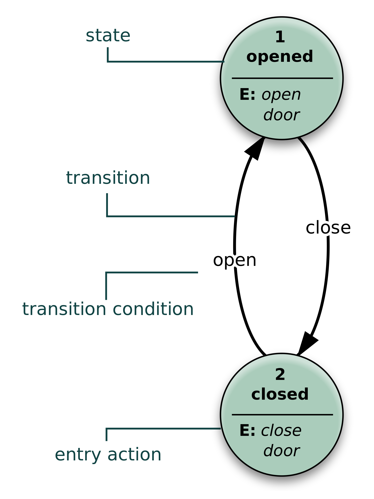

### What are state machines ?

We don't have much time. Look, a state machine is a bit like Redux but not that much like Redux.
A state machine is a specific, spec'd out way of approaching and describing the logic within a system.


Get it? That's simple state machine chart describing the states and transitions of a door machine (also known as a door).
With state machines we're describing a system in terms of the states it can take on and the transitions between them.
It's a mental framework that lends itself real good to solving certain problem.

### Why do I need state machines?

You don't need them for everything. Let's say we're writing the logic for a door in a game. It starts simple:
some encapsulation that might expose **open** and **close** methods for example. Except you also probably need logic to handle 
trying to open an open door and closing a closed door.

Then the designer requests the door can also be half-open and locked.

Now we're adding more conditions - **open** shouldn't work for a locked door, a half-open door can't **lock** etc. 
The logics gets messy real quick as more stuff keeps piling up. You'll be refactoring it a lot to keep it readable. It will probably
have bugs.

A state machine gives you a mental framework to approach and visualise this problem in systematic manner. XState gives you an actual framework
(i.e. code that runs) to implement the mental framework.

### Why do I need XState - I'll write my own state framework

You could but it's a bit like writing your own code to handle form validation - seems like a good idea 
until you start and realize it's way more work than you thought. XState is pretty mature and has an amazing 
vizualisation component that allows you to render and test your state machine in a visual manner like [this here](https://xstate.js.org/viz/?gist=bbcb4379b36edea0458f597e5eec2f91)

I can see that coming in handy when you're discussing the business logic with the stackholder...

### How do I start using XState in my React app

XState comes with React hooks, so it's pretty simple:
```javascript
import { useMachine } from '@xstate/react';
import { Machine } from 'xstate';

const toggleMachine = Machine({
  id: 'toggle',
  initial: 'inactive',
  states: {
    inactive: {
      on: { TOGGLE: 'active' }
    },
    active: {
      on: { TOGGLE: 'inactive' }
    }
  }
});

export const Toggler = () => {
  const [state, send] = useMachine(toggleMachine);

  return (
    <button onClick={() => send('TOGGLE')}>
      {state.value === 'inactive'
        ? 'Click to activate'
        : 'Active! Click to deactivate'}
    </button>
  );
};
```
This example (take from XState's [official page](https://github.com/davidkpiano/xstate)) defines a simple 
state machine with its states **active**, **inactive** and a single action (ie transition) **toggle**

### What's next?

Start small. You're not meant to have your entire app in a state machine. But next time you have to encapsulate some complex bit of logic in your React app - try to implement it 
as a state machine. It could be the start of a beautiful relationship. 
